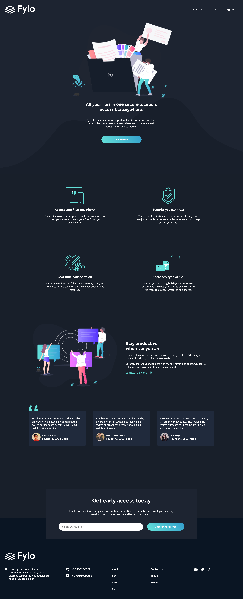
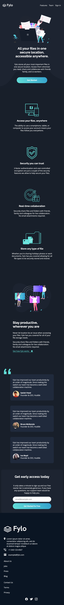

# Frontend Mentor - Fylo dark theme landing page solution

This is a solution to the [Fylo dark theme landing page challenge on Frontend Mentor](https://www.frontendmentor.io/challenges/fylo-dark-theme-landing-page-5ca5f2d21e82137ec91a50fd). Frontend Mentor challenges help you improve your coding skills by building realistic projects.

## Table of contents

- [Overview](#overview)
  - [The challenge](#the-challenge)
  - [Screenshot](#screenshot)
  - [Links](#links)
- [My process](#my-process)
  - [Built with](#built-with)
- [Author](#author)

## Overview

### The challenge

Users should be able to:

- View the optimal layout for the site depending on their device's screen size
- See hover states for all interactive elements on the page

### Screenshot

### Links

- Solution URL: [Frontend Mentor](https://www.frontendmentor.io/solutions/responsive-landing-page-using-css-grid--HrUJJIAB)
- Live Site URL: [Fylo-Landing-Page](https://letyoursoulglo.github.io/Fylo-Dark-Theme-Landing-Page/)

## My process

### Built with

- Semantic HTML5 markup
- Javascript
- CSS custom properties
- CSS Grid
- Mobile-first workflow

## Author

- Website - [Antonius Copeland](https://antcopeland.carrd.co/)
- Frontend Mentor - [@letyoursoulglo](https://www.frontendmentor.io/profile/letyoursoulglo)
- Twitter - [@YoungGifted_Blk](https://twitter.com/YoungGifted_Blk)
